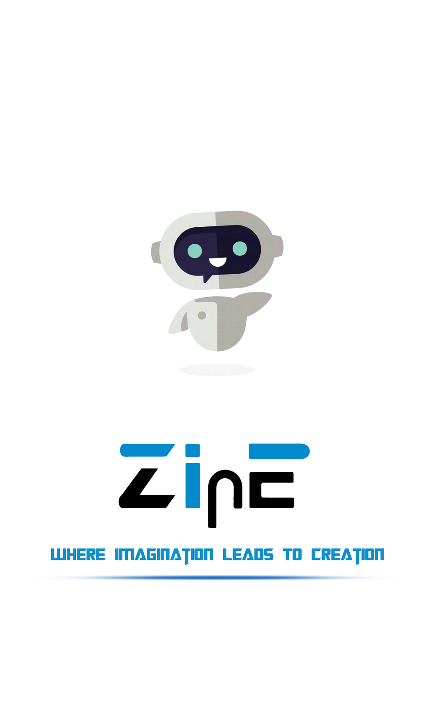
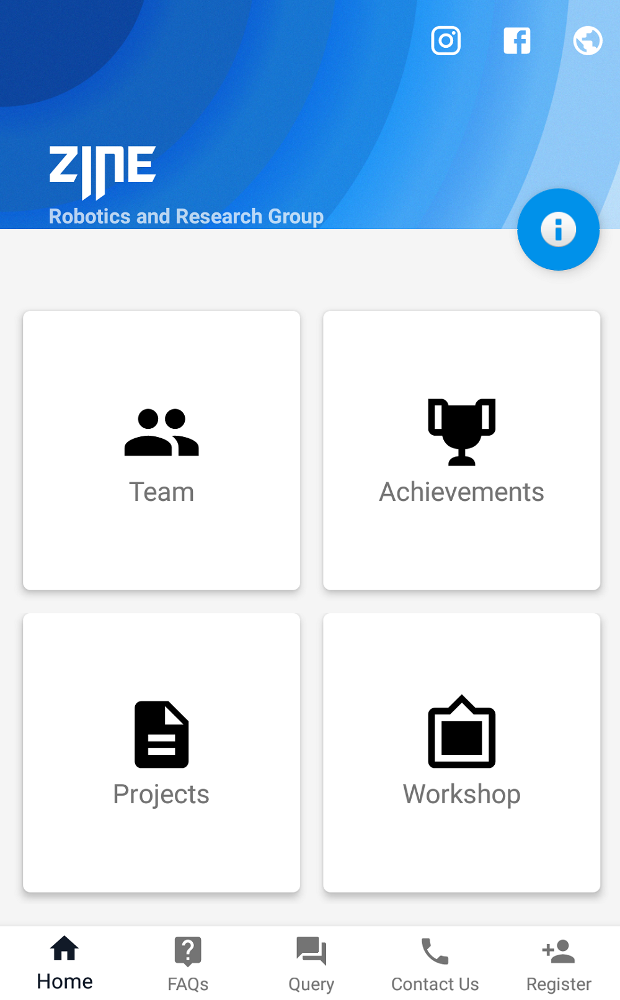
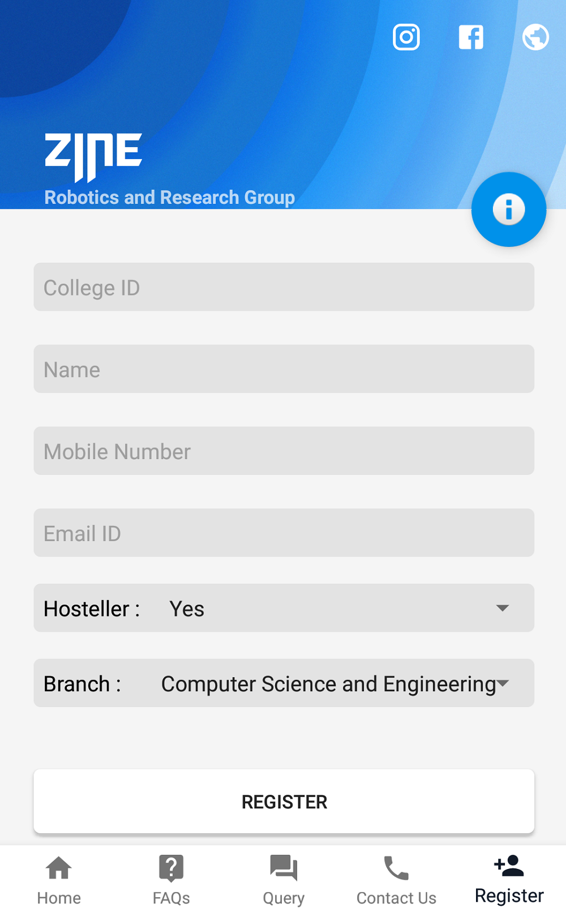
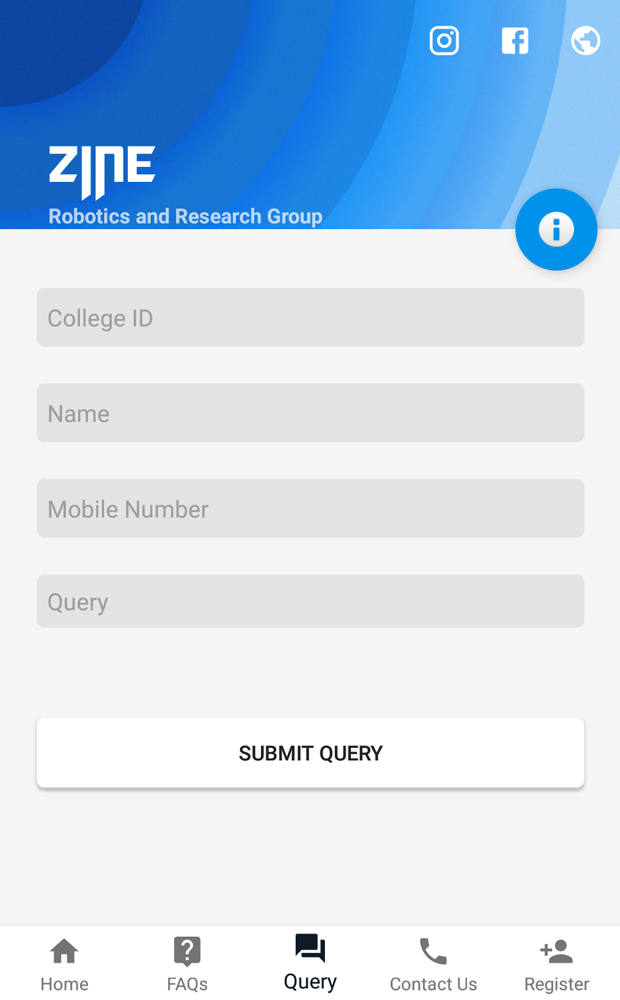

  

# ZINE

An App designed for the Zine Workshop 2018. The App includes Registration, Query, and Information regarding the current projects and the past achievements.

        
### APK File
- <a href="app/release/app-release.apk">ZINE</a>

### About Zine
Zine is the robotics and research group of Malaviya National Institute of Technology, Jaipur with a motive to foster undergraduate students and provide them with a platform to learn, explore and bring their imaginations to life.

### App Developer Team
  Sumit (https://github.com/isumit19)  
  Paarth Bir (https://github.com/paarthbir77)
  

# Credits

  Project : BottomBar (Depreciated)  
  Apache License 2.0  
  Copyright (c) 2016 Iiro Krankka (http://github.com/roughike)  
  License : https://github.com/roughike/BottomBar/blob/master/LICENSE  
  
  Project : CircleImageView  
  Apache License  
  Copyright 2014 - 2019 Henning Dodenhof. (https://github.com/hdodenhof/CircleImageView)  
  License : https://github.com/hdodenhof/CircleImageView/blob/master/LICENSE.txt  
  
  Project : CoverFlow  
  The MIT License (MIT)  
  Copyright (c) 2014 Marco Granatiero. (http://github.com/moondroid/CoverFlow)  
  License : https://github.com/moondroid/CoverFlow/blob/master/license  
  
  Project : GifImageView  
  The MIT License (MIT)  
  Copyright (c) 2014 Felipe Lima. (https://github.com/felipecsl/GifImageView)  
  License : https://github.com/felipecsl/GifImageView/blob/master/LICENSE  
  
  Project : Android-Coverflow  
  The MIT License (MIT)  
  Copyright (c) 2015 Hugo yu. (https://github.com/crosswall/Android-Coverflow)  
  License : https://github.com/crosswall/Android-Coverflow/blob/master/LICENSE  
